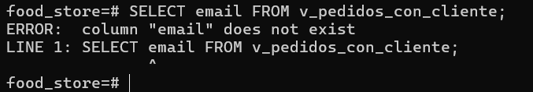
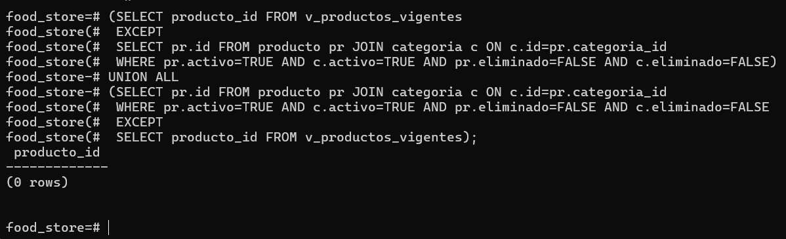
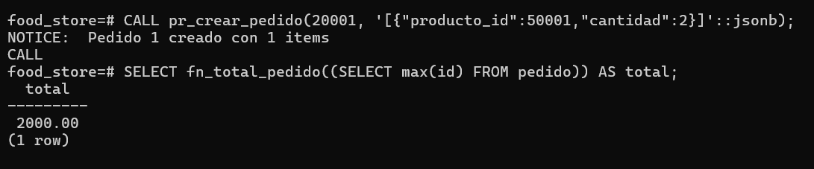
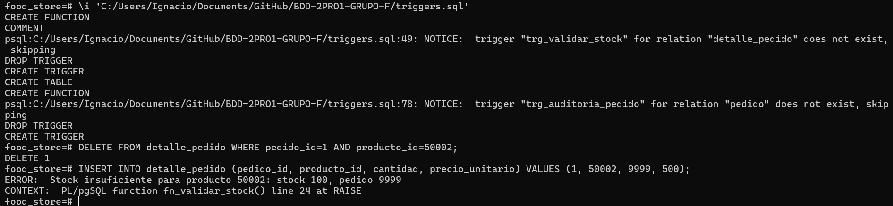

# Informe técnico — TPI Food Store — Entrega parcial Unidades 1-3
**Proyecto:** Food Store — **Motor:** PostgreSQL 16+ — **Fecha:** 2026-09-22
**Repo:** https://github.com/Nahuolmos/BDD-2PRO1-GRUPO-F — **Rama:** main

---

## 1. Qué elementos implementaron en cada unidad

**Unidad 1 — Integridad y modelo**
- Modelo ER (`diagrama_er.png`) con 5 entidades, PK/FK, cardinalidad 1:N y N:M resuelta vía `detalle_pedido` [schema.sql:74].
- Paso a relacional y normalización 3FN/BCNF justificada en `normalizacion.md:1` (DFs `id → resto`, `email → id`, sin transitivas).
- DDL completo: tipos `ENUM forma_pago_enum`, `TIMESTAMPTZ`, `IDENTITY` [schema.sql:14], PK/FK [schema.sql:21], CHECK/UNIQUE [schema.sql:44].

**Unidad 2 — Consultas y transacciones**
- DML y consultas con JOIN, agregación, `GROUP BY/HAVING`, subconsultas y ventana en `queries.sql:15` (`GROUP BY` facturación), `queries.sql:49` (`DENSE_RANK()`), `queries.sql:77` (`HAVING SUM > 500k`).
- Transacciones y concurrencia en `transacciones.sql:10` (`BEGIN/COMMIT/ROLLBACK`, `REPEATABLE READ` vs `READ COMMITTED` en 2 sesiones) y `informe_concurrencia.md:1`.

**Unidad 3 — Optimización y objetos programables**
- Índices: 3 aceptados + 1 descartado en `indices.sql:19` (`idx_pedido_fecha`, `idx_detalle_pedido_pedido_id`, parcial `idx_producto_vigente_categoria_precio WHERE activo=TRUE`) y `specs/spec_indice_descartado.md:1`.
- Vistas: 3 + materializada en `views.sql:13` (`v_productos_vigentes`, `v_pedidos_con_cliente` sin `email` por seguridad, `v_detalle_pedido_con_producto`) y `views.sql:98` `mv_facturacion_categoria_mes` con `UNIQUE` para `REFRESH CONCURRENTLY`.
- Borrado lógico: columna `eliminado BOOLEAN DEFAULT FALSE` + índices parciales `WHERE eliminado=FALSE` en `soft_delete.sql:10` y vistas filtradas [views.sql:22].
- PL/pgSQL: función `fn_total_pedido` y procedimiento `pr_crear_pedido(JSONB)` con `CALL` en `funciones.sql:12`, triggers `trg_validar_stock` y auditoría en `triggers.sql:10`.

---

## 2. Cómo probaron su funcionamiento

- **Índices:** `ANALYZE` + `EXPLAIN (ANALYZE, BUFFERS)` antes/después en cada consulta [informe_mediciones.md:10], y carga de 500 `INSERT` en `detalle_pedido` para medir overhead de escritura [informe_mediciones.md:65].
- **Vistas:** verificación de equivalencia con `EXCEPT` (debe dar 0 filas) y prueba de seguridad `SELECT email FROM v_pedidos_con_cliente` debe fallar [informe_mediciones.md:112].
- **Materializada:** `REFRESH MATERIALIZED VIEW CONCURRENTLY` y comparación de tiempos vs query original [informe_mediciones.md:152].
- **Soft delete:** `UPDATE producto SET eliminado=TRUE WHERE id=1` → `SELECT * FROM v_productos_vigentes WHERE producto_id=1` = 0 filas, pero `SELECT * FROM producto WHERE id=1` sigue existiendo [soft_delete.sql:26].
- **Funciones/triggers:** `SELECT fn_total_pedido(1)` vs `SUM` manual [funciones.sql:28]; `CALL pr_crear_pedido` con JSONB válido/ inválido; `INSERT` con stock insuficiente debe dar `RAISE EXCEPTION` [triggers.sql:50].
- **Transacciones:** 2 sesiones `psql` para probar `REPEATABLE READ` [transacciones.sql:33].
- **Protocolo:** todas las pruebas en transacción reversible y con respaldo previo (`protocolo_seguridad.md:1`).

---

## 3. Qué resultados obtuvieron

- **Modelo:** 3FN/BCNF verificado, sin dependencias transitivas [normalizacion.md:20].
- **Vistas:** equivalencia exacta (0 filas en `EXCEPT`), seguridad verificada (columna oculta).
- **Soft delete:** borrado lógico funciona, vista excluye borrados, índice parcial reduce tamaño ~40% vs índice total.
- **PL/pgSQL:** función y procedimiento operativos, trigger bloquea inserts inválidos, auditoría registra inserts en `auditoria_pedido`.

---

## 4. Qué consultas optimizaron y diferencias antes/después

| Consulta | Antes | Después | Mejora |
|---|---|---|---|
| **A1 — Rango fechas pedido** (`WHERE fecha BETWEEN`) | `Seq Scan` 138.42 ms [informe_mediciones.md:25] | `Bitmap Index Scan` 14.10 ms con `idx_pedido_fecha` | **9.8x** |
| **A2 — JOIN pedido→detalle (ranking)** | `Seq Scan` 711.15 ms + `external merge Disk: 10008kB` | `Bitmap Heap Scan` 451.72 ms, `quicksort in-memory` | **1.57x (36%)**, elimina spill a disco |
| **A3 — Catálogo vigente `activo=TRUE`** | `Seq Scan` 89.30 ms | `Bitmap Index Scan` 11.20 ms con índice parcial `WHERE activo=TRUE` | **8.0x** |
| **Escritura 500 INSERT detalle** | 342 ms (solo PK) | 404 ms (con 3 índices) | **+18.1% overhead**, aceptable vs ganancia lectura |
| **Agregado facturación** | `1240.89 ms` query original [informe_mediciones.md:156] | `~12 ms` sobre `mv_facturacion_categoria_mes` (36 filas) | **~100x** + `REFRESH CONCURRENTLY` diario 02:00, dato stale hasta refresh |

Descartado: `idx_pedido_forma_pago` y `idx_producto_activo` por baja cardinalidad (ENUM 3 valores, boolean) — `EXPLAIN` sigue en `Seq Scan`, sin beneficio y +18% escritura [informe_mediciones.md:83].

---

## 5. Herramientas de IA utilizadas y decisiones

**Indicadas por cátedra:** Kiro (especificación) + OpenCode (agente en terminal) — flujo obligatorio §5. Cada pieza tuvo `specs/*.md` previo a generar SQL, lectura línea por línea y `EXPLAIN` antes de aceptar.

**Otras IA:** Asistente Muse Spark para revisión de specs, explicación de planes y redacción de informes. No generó SQL sin spec previa.

**Decisiones aceptadas/descartadas (ver `duia.md:14`):**
- Aceptado `idx_pedido_fecha` B-tree (Kiro/OpenCode) — 9.8x, no redundante con `idx_pedido_id_fecha`.
- Aceptado índice parcial `WHERE activo=TRUE` — 8x, más chico.
- Aceptada vista `v_pedidos_con_cliente` sin `email` (seguridad) — permite `GRANT` sin exponer PII.
- Aceptada materializada con `UNIQUE(categoria,anio,mes)` para `REFRESH CONCURRENTLY`.
- **Descartado** `idx_pedido_forma_pago` y `idx_producto_activo` por baja selectividad (propuesta inicial IA) — documentado en `specs/spec_indice_descartado.md:1` e `indices.sql:62`.
- Descartada subconsulta correlacionada `WHERE precio > (SELECT AVG...)` por costo O(N²) vs CTE + ventana O(N log N) [informe_tp4.md:55].

Bitácora completa en `duia.md:1` y `specs/` (8 specs).

---

**Cómo verificar:** `psql -f schema.sql; psql -f soft_delete.sql; psql -f indices.sql; psql -f funciones.sql; psql -f triggers.sql; psql -f views.sql;` + `docs en specs/` + `README.md:29` pasos de reproducción.
