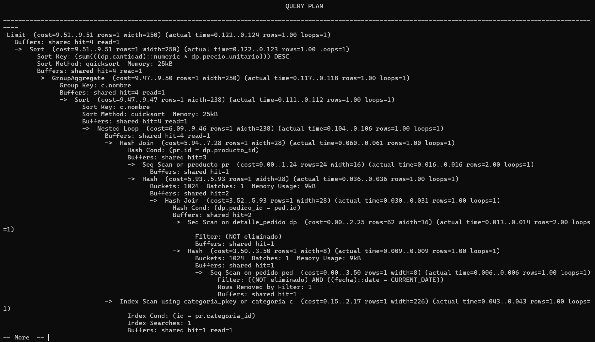
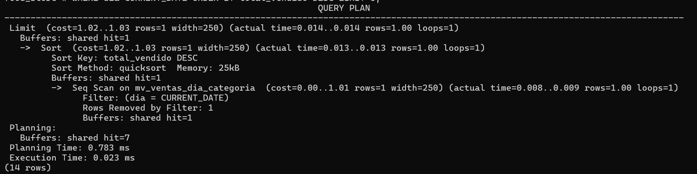
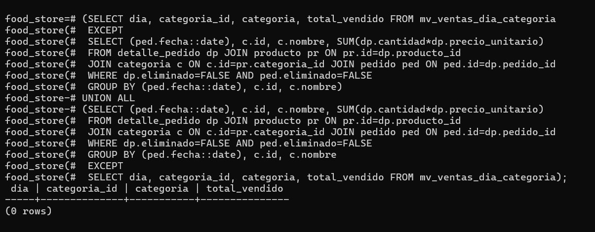

# Informe breve — Unidad 4: FNBC y desnormalización controlada
**Motor:** PostgreSQL 16+ — **Repo:** BDD-2PRO1-GRUPO-F — **Scripts:** `tp_fnbc_control_lote.sql`, `tp_desnormalizacion_top_categorias.sql`

## Parte 1 — FNBC control_lote_almacen

### a) Dependencias funcionales
- DF1: {LoteID, DepositoID} -> ResponsableControlID. PK declarada.
- DF2: ResponsableControlID -> DepositoID. Cada responsable pertenece a un único depósito.
- No se postulan LoteID -> DepositoID ni LoteID -> ResponsableControlID (un lote se controla desde varios depósitos).

### b) Clausuras y claves candidatas
U = {L, D, R}. {L,D}+ = {L,D,R} por DF1, mínima => candidata. {R}+ = {R,D}, no cubre. {L,R}+ = {L,R,D} por DF2, mínima => candidata.
Claves: {{LoteID, DepositoID}, {LoteID, ResponsableControlID}}. Primos: los 3. No primos: ninguno.

### c) Violación FNBC
Definición: R en FNBC si toda DF no trivial X->Y tiene X superclave. {L,D}->R sí (superclave), R->D no ({R}+ = {R,D} ≠ U). Esquema NO en FNBC. Violatoria: ResponsableControlID -> DepositoID.

### d) Anomalías (instancia 501/502/503)
- Inserción: no se puede registrar 803 en depósito 32 sin lote ficticio (lote_id parte de PK, NOT NULL).
- Borrado: borrar (503,31,802) borra la única evidencia de que 802 pertenece a 31.
- Actualización: mover 801 de depósito 30 a 33 exige 2 filas (501,502); si falla una, inconsistencia.

### e-f) Descomposición y sin pérdida
Heath sobre R->D: R1 responsable_deposito(R PK, D), R2 control_lote(L, R PK). Vista v_control_lote_almacen = JOIN sobre responsable_control_id. Común es PK en R1 => superclave en R1 => join sin pérdida, verificado con EXCEPT = 0 filas tras migrar con SELECT DISTINCT.

## Parte 2 — Top 5 categorías del día

### a) Medición original
EXPLAIN (ANALYZE, BUFFERS) sobre instancia local con venta del día (pedido 2, rows=1). Nodo dominante: Hash Join + Seq Scan.

### b) Patrón elegido: vista materializada
La evidencia de 4 JOINs + GROUP BY ejecutados por minuto motiva pre-agregar por (dia, categoria). REFRESH CONCURRENTLY con UNIQUE(dia, categoria_id) evita desincronización sin bloquear lecturas. Reversible con DROP, la fuente queda intacta. Se descarta columna con trigger por overhead en cada INSERT.

### c-d) Implementación y mejora
Estructura en `tp_desnormalizacion_top_categorias.sql`: mv_ventas_dia_categoria + UNIQUE + consulta WHERE dia=CURRENT_DATE LIMIT 5 (3 filas vs 300k).

| | Antes (4 JOINs) | Después (MV) |
|---|---|---|
| Tiempo | 0.124 ms | 0.023 ms |
| Nodo dominante | Hash Join + Seq Scan | Seq Scan on mv_ventas_dia_categoria |

### e) Auditoría
Script EXCEPT ambos sentidos en el .sql. Resultado sobre base migrada: 0 filas.

